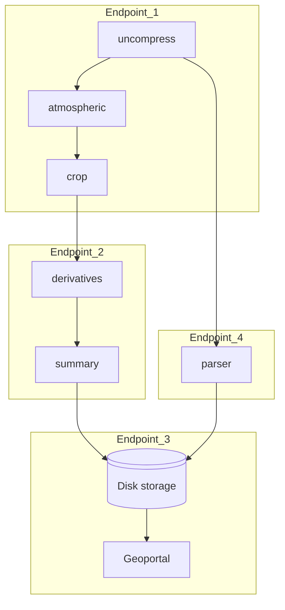

# Dagon* Landsat 8 corrections

Flujo de trabajo que corrije y obtiene productos derivados de imagenes satelitales Landsat8.

Etapas del flujo: descompresión, correcciones+productos derivados, parsing+indexing

Descargar imagenes satelitales ```Landsat8``` de https://earthexplorer.usgs.gov/

### Services

Available services are in the ```stages``` directory. The most relevant are the following:

*  ```uncompres```: a simple container with TAR installed to uncompress the images.
*  ```atmospheric```: contains an application to perform atmospheric corrections over scenes.
* ```radiometric```: performs radiometric corrections over the scenes.
* ```derivatives```: produces NDWI and NDVI indexes from the bands of a image.
* ```crop```: crop the bands of a image to an specific region specified by min and max coordinates.
* ```parser```: parses the metadata and get human-readeable information from the coordinates of the images.


### Examples of flows



### Construcción de las imagenes de  contenedore

```bash
cd stages/correcciones
docker build -t landsat:corrections .
cd stages/parser
docker build -t parser:landsat .
```
### Levantar base de datos

```bash
cd database
docker-compose up -d
```

### Ejecución Makeflow

```bash
cd makeflow
bash build.sh PATH_TO_IMAGES PATH_TO_OUTPUTS
docker exec -it landsattests bash
python build.py /inputs > workflow.jx
makeflow --jx --max-local=1 workflow.jx
```

## Ejecución Parsl

```
📦parsl
 ┣ 📂mongodbdata
 ┣ 📂parsl
 ┃ ┣ 📂apps <- Application source code and requirements
 ┃ ┃ ┣ 📂derivatives
 ┃ ┃ ┣ 📂parser
 ┃ ┃ ┗ 📜requirements.txt
 ┃ ┣ 📂indexing <- Results of the indexing stage
 ┃ ┣ 📂runinfo
 ┃ ┣ 📂uncompressed <- Results of the uncompressing and generation of derivative products stages
 ┃ ┣ 📜Parsl.Dockerfile
 ┃ ┗ 📜parslflow.py
 ┗ 📜docker-compose.yml
```

1. Dirigirse a la carpeta parsl y modificar la línea 9 del archivo ```docker-compose.yml``` con la ruta a los datos.

    ```YAML
    version: "3"
    services:
    parsltest:
        build:
        context: ./parsl
        dockerfile: Parsl.Dockerfile
        command: "tail -f /dev/null"
        volumes:
        - "./apps:/apps"
        - "/PATH/TO/DATA:/DATA/"
        - "./parsl:/parsltests"
    mongo:
        image: mongo:4.2
        restart: always
        expose:
        - "27017/tcp"
        volumes:
        - "./mongodbdata:/data/db"

    ```

2. Levantar los servicios con ```docker compose``` e ingresar al contenedor ```parsltest```.

    ```bash
    docker compose build
    docker compose up -d
    docker compose exec parsltest bash
    ```

3. Ejecutar el flujo con:

    ```bash
    python parslflow.py
    ```

    En pantalla se mostrarán los tiempos de ejecución de cada etapa.

    ```console
    root@b7911063bebb:/parsltests# python parslflow.py
    ---Uncompress 6.361931562423706 seconds ---
    ---Derivatives 19.980003833770752 seconds ---
    ---Indexing 0.6989550590515137 seconds ---
    root@b7911063bebb:/parsltests# 
    ```

    Las salidas las podrás ver en las carpetas ``ìndexing``` ```uncompressed```.

## Ejecución Nez

```
📦deployer
 ┣ 📂cfg-files <- Configuration files
 ┃ ┗ 📜configuration.cfg
 ┣ 📂results <- Deployment and execution results
 ┣ 📜Dockerfile
 ┗ 📜docker-compose.yml
```

1. Dirigirse a la carpeta stages y ejecutar el archivo ```build.sh``` para construir las imágenes de contenedor.

    ```bash
    cd stages
    bash build.sh
    ```

1. Dirigirse a la carpeta deployer.
3. Modificar el archivo ```deployer/cfg-files/configuration.cfg``` y cambiar la IP del BB de indexamiento (línea 9) así como la fuente de datos del stage ```uncompressingstage``` (línea 47).

    ```configuration
    [BB]
    name = uncompressing
    command = mkdir -p @D/@N && tar -xzvf @I -C @D/@N
    image = uncompress:landsat
    [END]

    [BB]
    name = indexing
    command = python /app/test.py @I/@N_MTL.txt @N IP_HOST:27018
    image = parser:landsat
    [END]

    [BB]
    name = corrections
    command = python /app/LS.py @I @N
    image = corrections:landsat
    [END]

    [PATTERN]
    name = indexingpattern
    task = indexing
    pattern = MW
    workers = 2
    loadbalancer = TC:D
    [END]

    [PATTERN]
    name = uncompressingpattern
    task = uncompressing
    pattern = MW
    workers = 2
    loadbalancer = TC:FR
    [END]

    [PATTERN]
    name = correctionspattern
    task = corrections
    pattern = MW
    workers = 1
    loadbalancer = TC:D
    [END]


    #Workflow definition
    [STAGE]
    name = uncompressingstage
    source = FUENTE_DATOS
    sink = correctionsstage
    transformation = uncompressingpattern
    [END]


    [STAGE]
    name = correctionsstage
    source = uncompressingstage
    sink = 
    transformation = correctionspattern
    [END]

    [STAGE]
    name = indexingstage
    source = uncompressingstage
    sink = 
    transformation = indexingpattern
    [END]


    #Workflow
    [WORKFLOW]
    name = workflow1
    stages = uncompressingstage correctionsstage indexingstage
    [END]

    ```

2. Modificar el archivo ```docker-compose.yml``` y cambiar las siguientes rutas:
    * ```FUENTE_DATOS``` (línea 11): Ruta absoluta al directorio donde se encuentran las imágenes en formato tar.gz.
    * ```PATH_TO_DEPLOYER``` (línea 14): Ruta absoluta donde se encuentra el directorio ```deployer```.

    ```YAML
    version: '3'
    services:
    deployer:
        image: ddomizzi/deployer:v1
        tty: true
        restart: unless-stopped
        #working_dir: /home/domizzi/Documents/geoprocindexing/deployer/
        volumes:
        - '/var/run/docker.sock:/var/run/docker.sock' #Docker deamon
        - './deployer/results:/home/app/results' #Deployer
        - '/PATH/TO/DATA:/PATH/TO/DATA' #Data source
        - './cfg-files:/cfg-files' #Configuration files
        environment:
        HOST_PATH: /PATH/TO/DEPLOYER
    ```

3. Levantar el servicio de despliegue y acceder al contenedor.

    ```bash
    docker compose up -d
    docker compose exec deployer bash
    ```

4. Despliega los contenedores del flujo con:

    ```bash
    ./puzzlemesh/puzzlemesh -m compose -c /cfg-files/configuration.cfg
    ```

En ```/PATH/TO/DEPLOYER/results``` verás que se crearon un conjunto de directorios, el cual es el espacio de trabajo de cada contenedor. Aquí se escribirán los resultados de la ejecución.

5. Ejecuta los contenedores con: 

    ```bash
    ./puzzlemesh/puzzlemesh -m compose -c /cfg-files/configuration.cfg -exec True
    ```

6. Para detener los contenedores del flujo ejecuta:

    ```bash
    ./puzzlemesh/puzzlemesh -m compose -c /cfg-files/configuration.cfg -stop True
    ```
